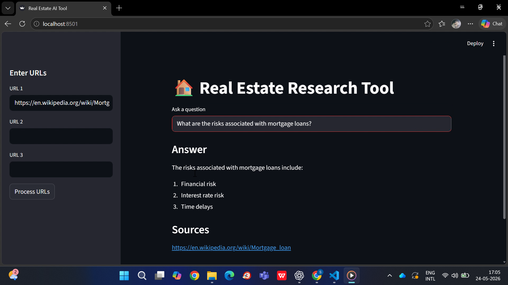

#  Real Estate Research Tool

We are going to build a user-friendly news research tool designed for effortless information retrieval. Users can input article URLs and ask questions to receive relevant insights from the real-estate domain. (But its features can be extended to any domain.)



### Features

- Load URLs to fetch article content.
- Process article content through LangChain's `UnstructuredURLLoader`
- Construct embedding vectors using HuggingFace embeddings and leverage ChromaDB as the vector store to enable swift and effective retrieval of relevant information.
- Interact with the LLM (Llama3 via Groq) by inputting queries and receiving answers along with source URLs.
- Perform context-based question answering using Retrieval-Augmented Generation (RAG).

### Set-up

1. Run the following command to install all dependencies.

```bash
pip install -r requirements.txt
```

2. Create a `.env` file with your GROQ credentials as follows:

```text
GROQ_API_KEY=YOUR_GROQ_API_KEY
```

3. Run the Streamlit app by executing the following command.

```bash
streamlit run main.py
```

### Usage / Examples

The web app will open in your browser after the setup is complete.

- On the sidebar, you can input URLs directly.
- Initiate data loading and processing by clicking **Process URLs**.
- Observe the system as it performs text splitting, generates embedding vectors using HuggingFace Embedding Model, and stores them in ChromaDB.
- Ask questions related to the processed articles and receive context-based answers.

In this project, we tested the tool using the following articles:

- https://en.wikipedia.org/wiki/Mortgage_loan
- https://en.wikipedia.org/wiki/Interest_rate
- https://en.wikipedia.org/wiki/Real_estate

### Note

Some modern websites (such as CNBC) use JavaScript rendering and bot protection mechanisms that may prevent proper content extraction using basic URL loaders.

For best results, use publicly accessible static webpages such as Wikipedia articles or blogs.

Advanced scraping tools like Selenium or Playwright can be integrated for handling dynamic websites.

</br>


